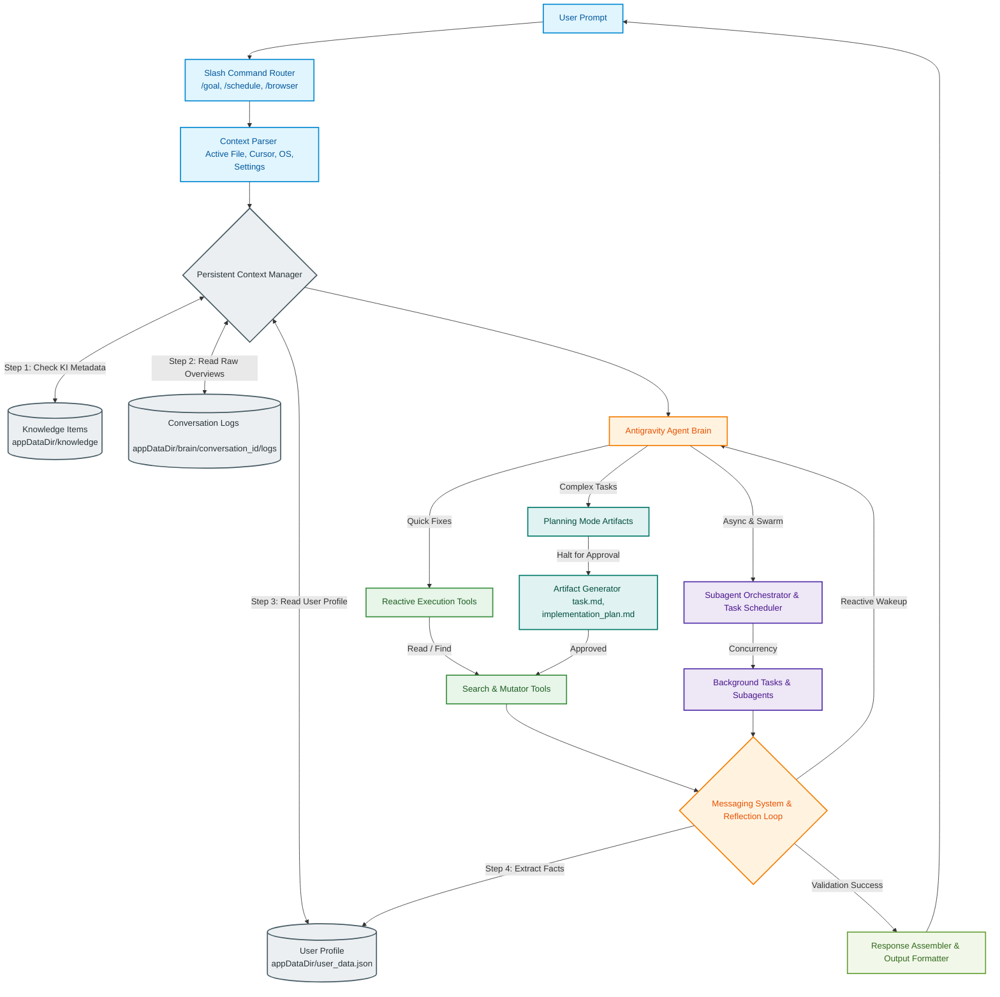

# Antigravity Agentic AI: Data Flow Specification

This document specifies the actual execution and data flow architecture of the **Antigravity Agentic AI Coding Assistant**. It aligns the components from `DATA FLOW.drawio` to represent how Antigravity handles context parsing, Knowledge Items (KIs), tool execution, verification, and output generation.

---

## 1. Architectural Overview

Antigravity operates as an autonomous loop that parses the IDE workspace environment, retrieves persistent context, executes precise filesystem/system operations, validates results, and formats outputs.

---

## 2. Component Breakdown & Specifications

### 2.1 Context Parser & Slash Command Router
- **Inputs**: Raw text, `/goal` (autonomous long-run), `/schedule` (timers), `/browser` (web testing), `/grill-me` (alignment).
- **Operations**: Routes special commands automatically or merges standard prompts with local editor variables (cursor, open docs) for the Brain.

---

### 2.2 Persistent Context Manager
- **Step 1: Knowledge Items (KIs)**: Scans file metadata at `C:\Users\AJINKYA\.gemini\antigravity\knowledge\metadata.json` for persistent guidelines.
- **Step 2: Conversation Logs**: Extracts historical records from `\brain\<conversation_id>\.system_generated\logs\transcript.jsonl`.
- **Step 3: User Profile & Preferences**: Reads structured user details (name, OS, languages, constraints) from `user_data.json` and injects them into the system prompts for router, reactive execution, and complex task planning.
- **Step 4: AI Extraction Reflection Loop**: After each message exchange, the Reflection Loop uses the low model to extract/refine facts from the latest turn and saves them back to `user_data.json`.

---

### 2.3 Antigravity Agent Brain (The Core Router)
Determines the operational mode and the **Model Capacity** based on task complexity.
- **Reactive Mode (Low Model)**: Direct execution of simple context lookups and quick bug fixes using a fast, smaller model (e.g., `llama3`).
- **Planning Mode (High Model)**: For complex features or new file creation, routes to a high-capacity model (e.g., `llama3:70b` or `qwen`). Halts execution to generate a detailed `implementation_plan.md` artifact.
- **Subagent & Async Mode**: Spawns multiple threads for long-running processes (testing, building, code research).

---

### 2.4 The Execution & Swarm Layer

| Category | Tool | Main Operations / Parameters |
| :--- | :--- | :--- |
| **Search / Context** | `list_dir`, `grep_search`, `view_file` | Inspects workspace structure, parses codebase. |
| **Mutators** | `replace_file_content`, `write_to_file` | Edits code safely. **Restricted strictly to a user-selected workspace directory at startup.** |
| **Subagents** | `invoke_subagent`, `send_message` | Spawns `research`, `self`, or custom agent swarms to work concurrently. |
| **Background Tasks** | `manage_task`, `schedule` | Sets cron jobs, timers, or sends stdin to persistent async shells. |

---

### 2.5 Reactive Messaging System & Reflection Loop
- **Logic**: Antigravity uses a purely reactive wakeup mechanism. It does **not** poll.
  - When a background subagent finishes, or a scheduled cron triggers, it instantly pushes a notification message into the Agent's context.
  - The Reflection Loop analyzes compiler traces or test logs from these wakeup events. If tests fail, it reflects and adjusts file paths or syntax.

---

### 2.6 Artifact Generation & Response Assembler
- **Artifacts**: Living markdown documents tracking state: `task.md` (TODOs), `implementation_plan.md` (design), `walkthrough.md` (post-mortem). Saved persistently in `\brain\<conversation_id>\`.
- **Response Assembler**: Combines findings and outputs concise, github-flavored markdown directly into the UI.
